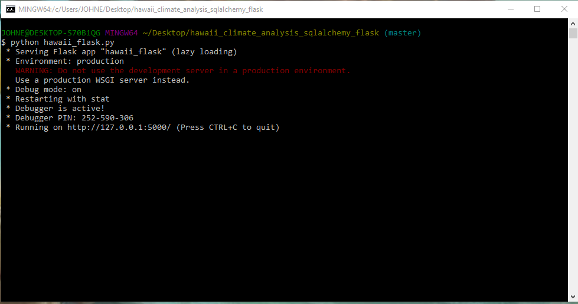
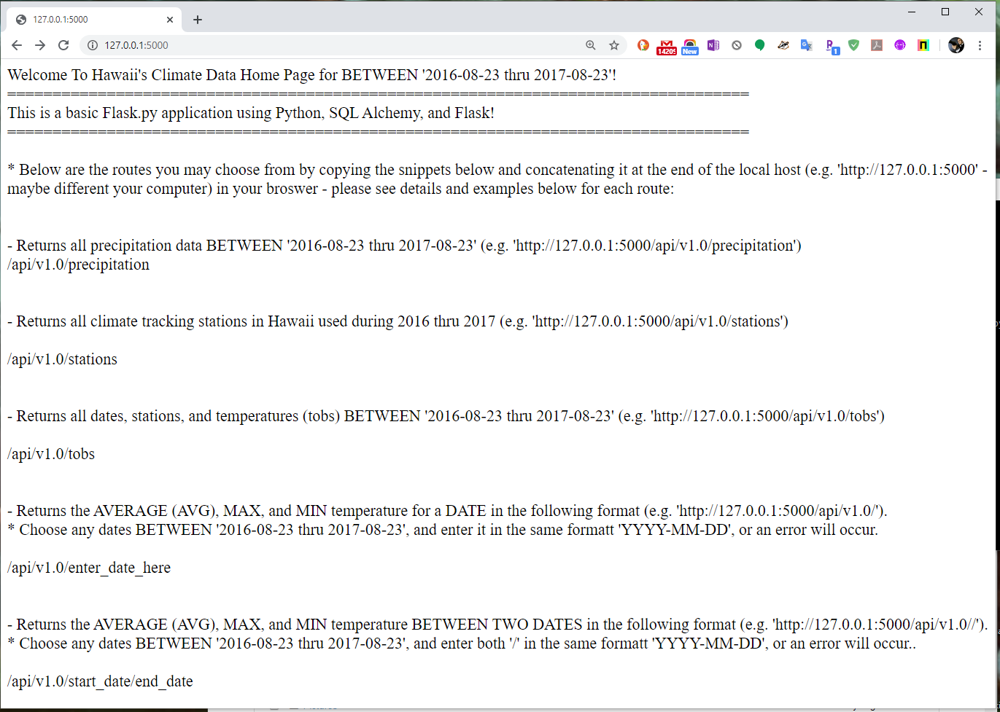
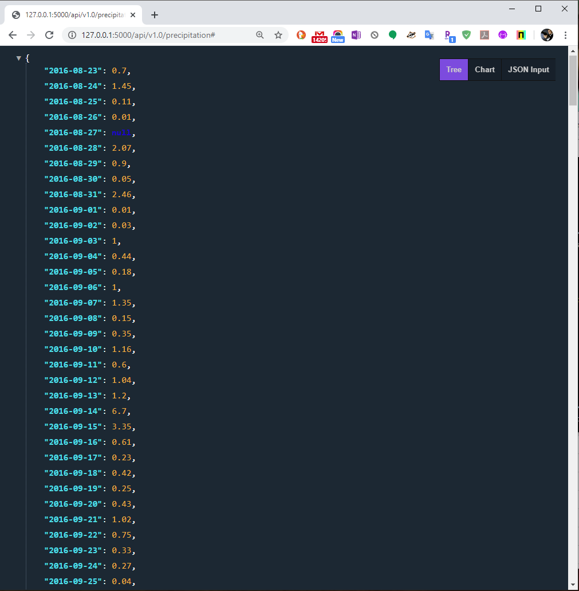
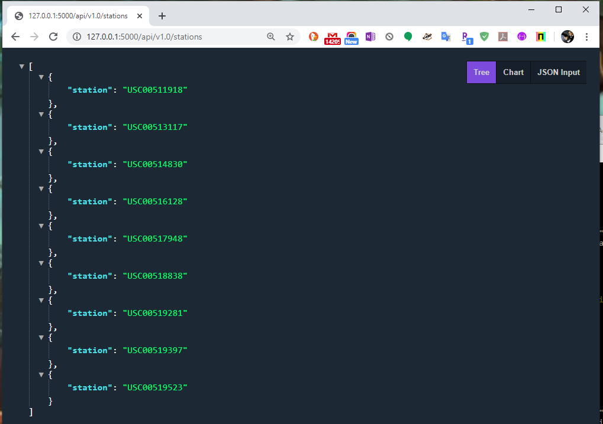
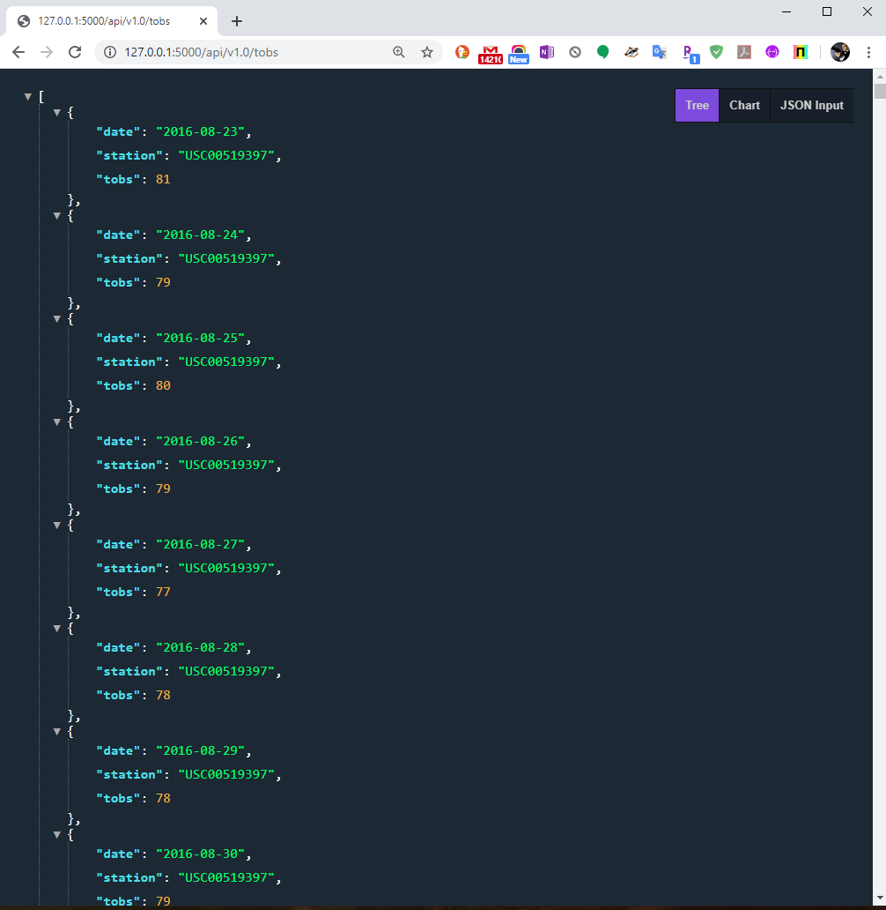
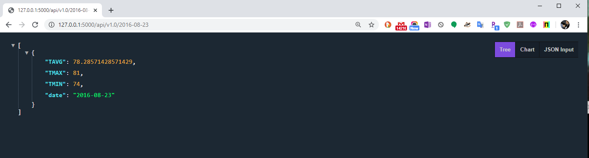
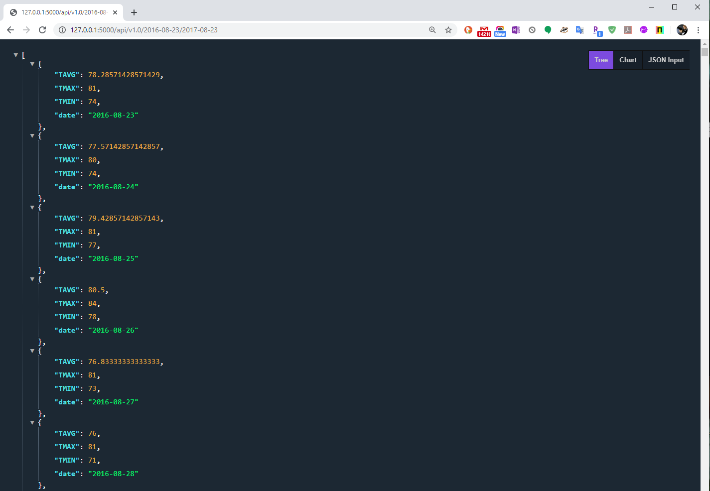
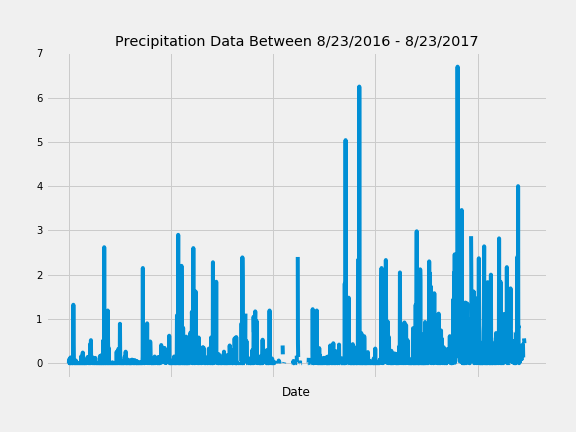
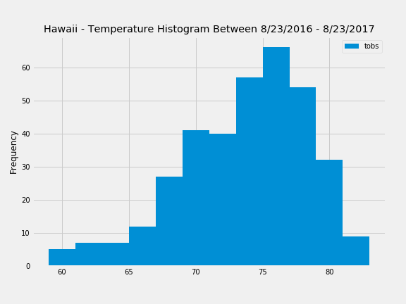

# Aloha State Of Mind - A Climate Analysis And Exploration Of Hawaii Between August 23, 2016 - August 23, 2017

## Scope

* For this project, I wanted to further develop my Python and SQL Alchemy skills, and build a Flask app, which is the main emphasis of this project. I used data data from the attached SQL-Lite file in the 'Resources' folder. First, I wrote queries in Python and SQL Alchemy to query the SQL-Lite file of Hawaiian weather data, made quick charts via Pandas plots, and then I built a Flask app so that you could view the data in a browser using a local server.

## Purpose
* I went to Hawaii a few years ago, and fell in love with the tropical island life, culture, food and the weather. The thought of Hawaii brought me back good memories, so I decided to do a project on weather data to further develop my skills.
 
## System Prerequisites
You will need the following installed on your computer system, if you want to replicate my analysis:
* Python >= 3.7 and the associated libraries:
  * numpy
  * pandas
  * datetime
  * matplotlib
  * sqlalchemy
* Git Bash (https://gitforwindows.org/)
* Jupyter Notebook - all of the programming reside in these files

## Getting Started

* Viewing Source Code - if this is the route you'd like to go, then please click on the Jupyter Notebooks in the repository and the Flask app, as you can easily view the code via Github. All of the action is here!
* Clone / Download Entire Repository - if you'd like to replicate my work, please download / clone my repository and install all of the prerequisites. After, you can open the Jupyter Notebooks to see all of the raw calcuations and code.
* Hawaii_Flask.py app
  * If you want to run this, you'll need to download the repository on your computer
  * Open the folder
  * Open up a terminal by right clicking directly in that folde
  * Type into the terminal "python Hawaii_Flask.py" and press enter to run the file
  * The output will be a local server http address as you'll see in the next section below, where I've included pictures to follow along below

## Running the Flask App - Screenshots

## Findings

* Below is a quick chart displaying the daily precipitation data from August 23, 2016 - August 23, 2017, in chronological order. The data suggest that the islands have had increasing higher precipitation in 2017, compared to 2016, meaning there was higher probability for more rainfall.

* Here is a histogram of the most frequent temperatures in Hawaii from August 23, 2016 - August 23, 2017. The data suggests that Hawaii's average temperature is frequently around 75 degrees. This makes sense because the island is geographically closer to the equator compared to most countries and islands, and it is known as a year-round destination for vacation and tourism.

## Next Steps Considerations
* Spend more time making nicer charts
* Build a nice Data Visualization using HTML, CSS, and JavaScript to display the Flask app data

### Personal Note
* Hope you enjoyed it. Thank you for your time!

## Author

* **Johneson Giang** - *Invidual Project* - [Github](https://github.com/jhustles)

## License

This project is licensed under the MIT License - see the [LICENSE.md](LICENSE.md) file for details

## Acknowledgments
* I definitely want to give a shout out to my dear teacher, mentor, and friend @CodingWithCorgis!